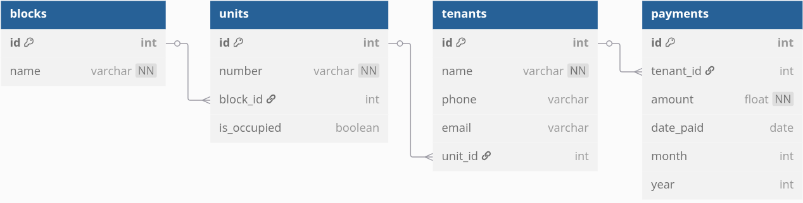

# Apartment Tenant Management System (CLI)

This is a command-line interface (CLI) application built with Python and SQLAlchemy to manage an apartment complex. It allows users to create and manage blocks, units, tenants, and rent payments through an interactive menu-based system.

---

### Features

- Create and list apartment blocks
- Add and manage units within each block
- Register tenants and assign them to units
- Record rent payments
- List all payments or filter by tenant/payment
- Identify tenants with pending payments
- Vacate tenants and mark units as available
- Interactive CLI with index-based navigation using `click`

---

### File Structure

```
.
├── cli.py                          # Main CLI application
├── lib
│   ├── db
│   │   ├── connection.py          # SQLAlchemy engine and session setup
│   │   └── __init__.py
│   └── models
│       ├── block.py               # Block model and related methods
│       ├── unit.py                # Unit model and related methods
│       ├── tenant.py              # Tenant model and related methods
│       ├── payment.py             # Payment model and related methods
│       └── __init__.py
├── my_estate.db                   # SQLite database file
├── Pipfile                        # Pipenv environment definition
├── Pipfile.lock                   # Locked dependencies
├── requirements.txt               # List of required packages (for pip)
├── README.md                      # Project documentation
└── scripts
    ├── db_setup.py                # Optional: initial DB creation script
    └── seed_data(manual).py       # Manual seed data covering various scenarios
```

---

### Database Structure

The diagram below shows the relationships between Blocks, Units, Tenants, and Payments.



---

### Setup Instructions

#### 1. Clone the repository
```bash
git clone https://github.com/Michael-Ngochi/Apartment-tenant-management-system-CLI-.git
cd Apartment-tenant-management-system-CLI-
```

#### 2. Create a virtual environment
Using Pipenv:
```bash
pipenv install
pipenv shell
```

Or using pip:
```bash
python3 -m venv venv
source venv/bin/activate
pip install -r requirements.txt
```

#### 3. Run the seed script (optional)
```bash
python scripts/seed_data(manual).py
```

#### 4. Launch the CLI
```bash
python cli.py
```

---

### Notes

- The system uses SQLite as the default database (`my_estate.db`)
- The application is modular and easy to extend
- Seed data includes scenarios such as:
  - Units with multiple tenants
  - Units with no tenants (vacant)
  - Tenants with and without rent payments

---

### Dependencies

- Python 3.11
- SQLAlchemy
- Click

Install via:
```bash
pip install -r requirements.txt
```

or

```bash
pipenv install
```